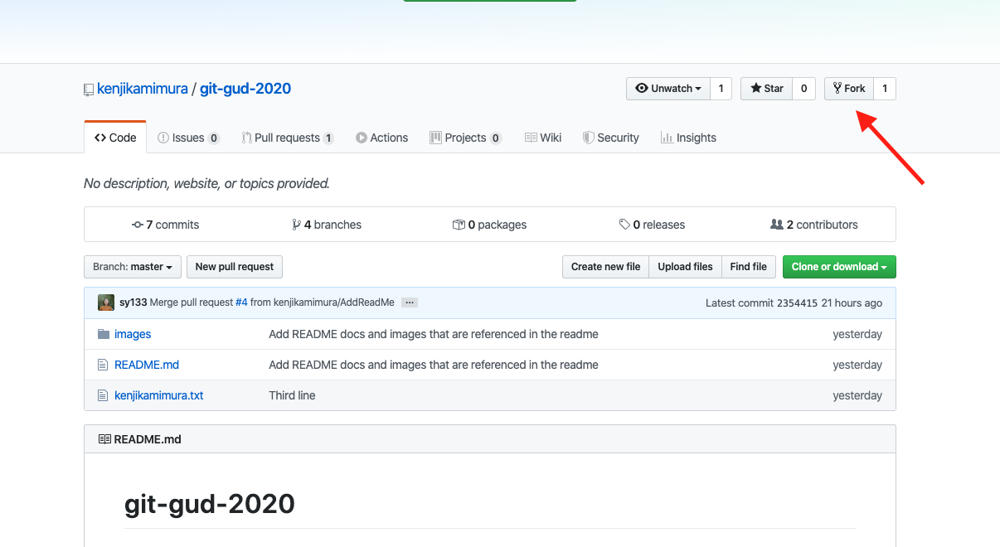
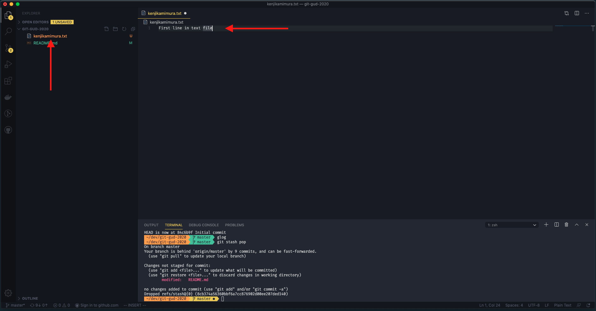
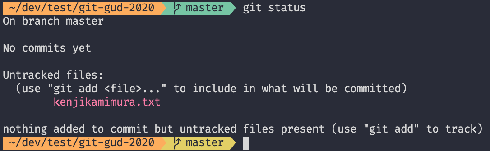
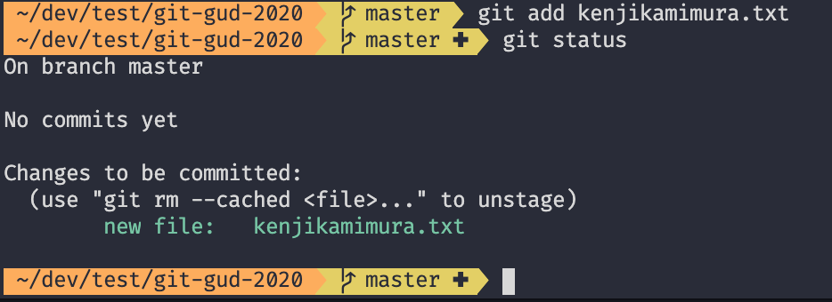
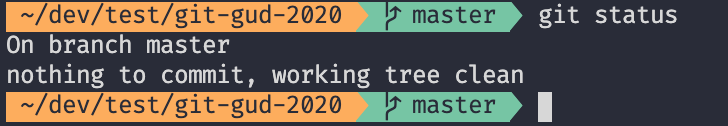
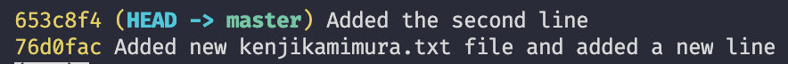
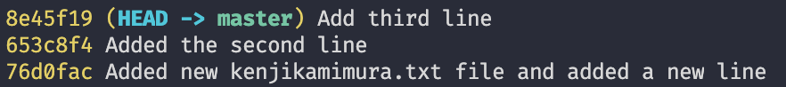
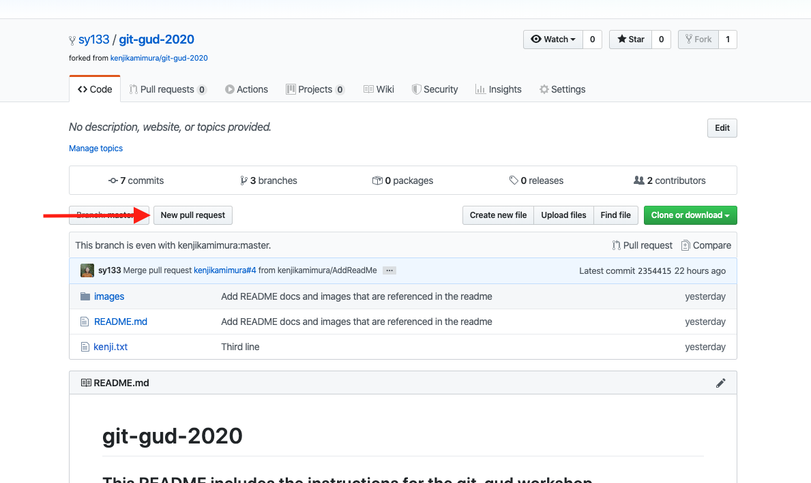
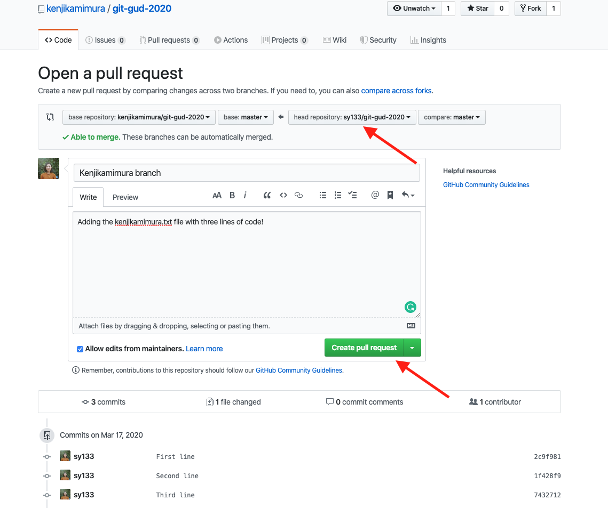

# git-gud-2021

## This README includes the instructions for the git-gud workshop.

---

## **Setting up:**

## 1.0 Fork the main repository

- Navigate to https://github.com/kenjikamimura/git-gud-2021
- Click on the Fork button. This creates your own copy of the reporitory on your own Github account.
   

## 1.1 Clone the Repository

- In your own fork repository on github, click on the green "Clone or download" button and copy the url of it. (It should look like something like this: https://github.com/sy133/git-gud-2021.git where your github user name is in the url).
- In your terminal, navigate to where you would like clone the project. Then type the command below. (This will copy the repository in github to your local computer).

        git clone https://github.com/<Your github username>/git-gud-2021.git

- Navigate into the repository:

        cd git-gud-2021

## **Version Tracking**

## 2. Create a new text file

- Open the repository in your favourite text editor (VsCode) and create a new text file with your name (e.g: kenjikamimura.txt).

* Add one line to the text file.

  

## 3. Check the current git status

- Save the text file and in the terminal type the command below:

        git status

- This will show that the newly added file is unstaged/untracked

  

## 4. Add the new changes to the staging area

- Type the command below. This will move the newly added file to the staging area

        git add <name of the newly added file>

        e.g: git add kenjikamimura.txt

## 5. Check the status again

Type the command below.

        git status

- This should show the new files are in the staging area

  

## 6. Commit your changes

- Type the command below. Ensure you use a good commit message as these will help keep track of your code changes.

        git commit -m "New kenjikamimura.txt file and added a new line"

## 7. Check the status again

- This will show there is no new changes! (Beause the changes got committed!)

  

## 8. Check the git log

- Type the command below. This will show a log of the current history.

        git log --oneline

* You should see your newly added commit at the end of the log. Dont worry if you see more than 1 log entry. These show all the other commits made by other people before you cloned the repository. 

  

---

## 9. Add more changes and commit them

- Now that you have created a commit, add a second line to the file you created.
- Save the file.
- Add the changes using `git add <file name>`
- Commit the changes using `git commit -m <commit message>`
- Using `git log --oneline` you will now be able to see the second commit!
  

## 10. Add a third line and commit them

- Repeat step 9 and check the git log. You should see a third commit you made!
  
- Congratulations! You have successfully added version control to your new file! The following steps help create a pull request to get these new changes into the remote repostory.

---

## **Collaboration**

## 11. Push your changes to your fork's remote repository

- The command below will push all the new commits to the master branch in **your forked** remote repository.
  (Note: origin is the default name given to the remote repository)

          git push origin master

## Create the Pull Request

- Navigate to your fork URL (e.g. https://github.com/sy133/git-gud-2021)
- Click on the "New Pull Request" button
  

- Check the fork you wish to make the pull request from is your personal forked repository master branch
  

- Click the green "Create pull request" button.
- Congratulations, you have successfully made a Pull Request to the remote repository. Now you will have to wait until the owner of the repository approves and merges your pull request.

## Seeing your changes

- Once your changes have been approved and merged, you can see your changes and other people's changes to the remote repository on https://github.com/kenjikamimura/git-gud-2021

- These changes are now part of the source of truth!